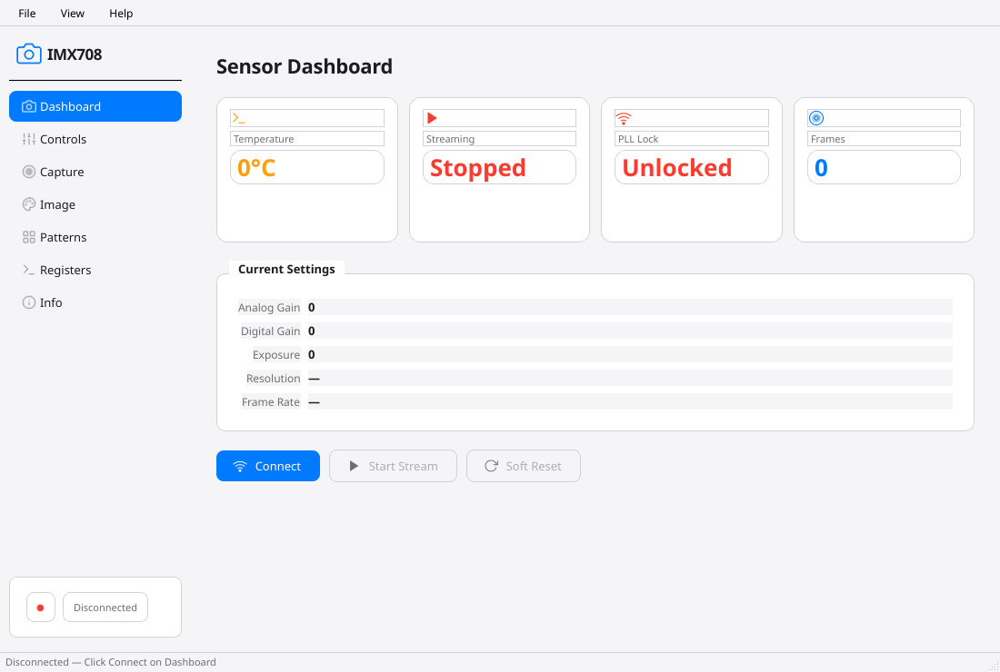

# 🎨 IMX708 GUI — Cross-Platform Desktop Client for Sony IMX708 Camera

> **A stunning macOS-inspired PySide6 desktop application for controlling the Sony IMX708 12MP camera sensor over gRPC.** Features a beautiful sidebar navigation, real-time telemetry, and full sensor control — all wrapped in a native-feeling cross-platform UI.

[](LICENSE)
[](pyproject.toml)
[](requirements.txt)
[](requirements.txt)
[](build.sh)

---

## 🖥️ Application Preview



*A live screenshot of the IMX708 GUI showing the Dashboard with sidebar navigation, status cards, and control sliders.*

---

## 🏗️ Architecture

```
┌─────────────────────────────────────────────────────────────────────┐
│                        IMX708 GUI (PySide6)                         │
│                                                                      │
│  ┌──────────────────────────────────────────────────────────────┐   │
│  │                    Main Window (QMainWindow)                   │   │
│  │                                                               │   │
│  │  ┌────────────┐  ┌────────────────────────────────────────┐   │   │
│  │  │  Sidebar   │  │           Stacked Widget                │   │   │
│  │  │  (QList)   │  │  ┌──────────────────────────────────┐  │   │   │
│  │  │            │  │  │  Dashboard Screen                │  │   │   │
│  │  │  📷 Dash  │  │  │  • Status cards (temp, FPS, PLL) │  │   │   │
│  │  │  🎛️ Ctrl  │  │  │  • Connect/Stream/Reset buttons  │  │   │   │
│  │  │  📸 Cap   │  │  │  • Gain/Exposure/HDR sliders     │  │   │   │
│  │  │  🎨 Patt  │  │  └──────────────────────────────────┘  │   │   │
│  │  │  🔧 Reg   │  │  ┌──────────────────────────────────┐  │   │   │
│  │  │  ℹ️ Info  │  │  │  Controls Screen                 │  │   │   │
│  │  │            │  │  │  • Analog/Digital gain sliders  │  │   │   │
│  │  │            │  │  │  • Exposure slider              │  │   │   │
│  │  │            │  │  │  • HDR mode toggle + ratio      │  │   │   │
│  │  │            │  │  └──────────────────────────────────┘  │   │   │
│  │  │            │  │  ┌──────────────────────────────────┐  │   │   │
│  │  │            │  │  │  Capture Screen                 │  │   │   │
│  │  │            │  │  │  • Frame capture with preview    │  │   │   │
│  │  │            │  │  │  • Format selection, save to file│  │   │   │
│  │  │            │  │  └──────────────────────────────────┘  │   │   │
│  │  │            │  │  ┌──────────────────────────────────┐  │   │   │
│  │  │            │  │  │  Test Patterns Screen            │  │   │   │
│  │  │            │  │  │  • 5 patterns with color control │  │   │   │
│  │  │            │  │  └──────────────────────────────────┘  │   │   │
│  │  │            │  │  ┌──────────────────────────────────┐  │   │   │
│  │  │            │  │  │  Registers Screen                │  │   │   │
│  │  │            │  │  │  • Known register quick-access   │  │   │   │
│  │  │            │  │  │  • Custom read/write             │  │   │   │
│  │  │            │  │  └──────────────────────────────────┘  │   │   │
│  │  │            │  │  ┌──────────────────────────────────┐  │   │   │
│  │  │            │  │  │  Info Screen                     │  │   │   │
│  │  │            │  │  │  • Sensor specs, driver features │  │   │   │
│  │  │            │  │  │  • Mode table viewer             │  │   │   │
│  │  │            │  │  └──────────────────────────────────┘  │   │   │
│  │  └────────────┘  └────────────────────────────────────────┘   │   │
│  └──────────────────────────────────────────────────────────────┘   │
│                                                                      │
│  ┌──────────────────────────────────────────────────────────────┐   │
│  │                    Background Threads                         │   │
│  │  ┌────────────────────┐  ┌────────────────────┐              │   │
│  │  │  StatusPoller      │  │  FrameStreamer     │              │   │
│  │  │  • Polls GetStatus │  │  • Streams frames  │              │   │
│  │  │    every 500ms     │  │    via gRPC        │              │   │
│  │  │  • Updates UI via  │  │  • Emits QImage    │              │   │
│  │  │    Qt signals      │  │    for display     │              │   │
│  │  └────────────────────┘  └────────────────────┘              │   │
│  └──────────────────────────────────────────────────────────────┘   │
│                                                                      │
│  ┌──────────────────────────────────────────────────────────────┐   │
│  │                    gRPC Network Layer                        │   │
│  │  ┌────────────────────────────────────────────────────────┐  │   │
│  │  │  imx708_pb2 / imx708_pb2_grpc (generated stubs)        │  │   │
│  │  │  insecure_channel → server:50051                        │  │   │
│  │  └────────────────────────────────────────────────────────┘  │   │
│  └──────────────────────────────────────────────────────────────┘   │
└─────────────────────────────────────────────────────────────────────┘
```

---

## ✨ Features

### 🎨 macOS-Inspired Design
- **Beautiful sidebar** — SVG icons with hover effects and active state
- **Smooth animations** — QPropertyAnimation for transitions
- **Dark/light aware** — adapts to system theme
- **Native feel** — custom-styled widgets that blend with the desktop
- **Responsive layout** — resizable panels with QSplitter

### 📊 Dashboard — Real-Time Sensor Telemetry
- **Live status cards** — temperature, FPS, resolution, PLL lock, frame count
- **Connection controls** — Connect/Disconnect, Start/Stop Stream, Soft Reset
- **Quick controls** — gain slider, exposure slider, HDR toggle
- **Status bar** — connection state, streaming state, error messages

### 🎛️ Controls — Full Sensor Configuration
- **Analog Gain** — slider with fine-tune spinbox (0–960)
- **Digital Gain** — slider with fine-tune spinbox (256–65535)
- **Exposure** — slider with live readout (8–65487 line units)
- **HDR Mode** — toggle with ratio selector (2×, 3×, 4×)
- **Short Exposure/Gain** — HDR-specific controls

### 📸 Capture — Frame Acquisition
- **Single capture** — one-shot frame grab
- **Burst mode** — configurable number of frames
- **Format selection** — RAW10, JPEG (via conversion)
- **Save to file** — with custom filename and location
- **Frame info** — timestamp, dimensions, gain, exposure metadata

### 🎨 Test Patterns — Built-In Pattern Generator
| Pattern | Description |
|---------|-------------|
| Disabled | Normal sensor operation |
| Color Bars | Standard SMPTE color bars |
| Solid Color | User-selectable solid color |
| Grey Bars | Grayscale gradient bars |
| Walking 1s | Digital walking-ones pattern |
| Vertical Color Bars | Vertical stripe pattern |
| Horizontal Color Bars | Horizontal stripe pattern |
| Alternate Pattern | Checkerboard alternate |

- **Per-channel color control** — R, Gr, B, Gb components
- **Brightness control** — pattern brightness adjustment

### 🔧 Registers — Direct Hardware Access (Debug)
- **Known register quick-access** — dropdown of documented registers
- **Custom read** — enter any 16-bit address, see 8-bit value
- **Custom write** — write any value to any register
- **Read history** — log of recent register reads

### ℹ️ Info — Sensor Reference
- **Sensor specifications** — resolution, pixel size, optical format
- **Driver features** — supported V4L2 controls, capabilities
- **Mode table** — all supported resolutions with timings
- **Register map** — quick reference to key register addresses

### 🔄 Real-Time Updates
- **Status polling** — automatic refresh every 500ms via background thread
- **Frame streaming** — continuous frame display via gRPC streaming
- **Error reporting** — connection errors, sensor errors displayed in status bar
- **Non-blocking UI** — all network operations on background threads

---

## 🚀 Quick Start

### Installation
```bash
# 1. Clone and enter directory
cd imx708-gui

# 2. Install Python dependencies
pip install -r requirements.txt

# 3. Generate gRPC stubs
./build.sh

# 4. Run the GUI
python3 imx708_client.py --server 192.168.1.100:50051
```

### Build Standalone Executable
```bash
# Build a single-file executable with PyInstaller
./build.sh --exe

# The executable will be in dist/
./dist/imx708_client --server 192.168.1.100:50051
```

### Command Line Options
```
python3 imx708_client.py [options]

Options:
  --server <host:port>    gRPC server address (default: localhost:50051)
  --help                   Show this help
```

---

## 📁 Project Structure

```
imx708-gui/
├── imx708_client.py            # Main application (PySide6 GUI)
├── build.sh                    # Build script (gRPC stubs + PyInstaller)
├── Makefile                    # Make targets for common operations
├── pyproject.toml              # Python project metadata
├── requirements.txt            # Python dependencies
├── uv.lock                     # Lock file (uv package manager)
├── VERSION                     # Version file
├── LICENSE                     # GPL-2.0-only
├── README.md                   # This file
│
├── proto/
│   └── imx708.proto            # gRPC service definition (shared with server)
│
└── imx708_gui.egg-info/        # Package metadata (generated)
```

---

## 🎮 Screen Reference

### Dashboard
```
┌─────────────────────────────────────────────────────────────┐
│  📊 DASHBOARD                                              │
│                                                             │
│  ┌──────────┐ ┌──────────┐ ┌──────────┐ ┌──────────┐      │
│  │  32°C    │ │  56 fps  │ │ 4608×2592│ │  ✅ PLL  │      │
│  │  Temp    │ │  Frame   │ │  Resol.  │ │  Locked  │      │
│  └──────────┘ └──────────┘ └──────────┘ └──────────┘      │
│                                                             │
│  [🔴 Connect]  [▶ Start Stream]  [⏹ Stop]  [🔄 Reset]   │
│                                                             │
│  Gain:  ════════════○═══════════  480/960                  │
│  Exp:   ════════════════○═══════  1600/65487               │
│  HDR:   [OFF]  Ratio: [4x ▼]                              │
└─────────────────────────────────────────────────────────────┘
```

### Controls
```
┌─────────────────────────────────────────────────────────────┐
│  🎛️ CONTROLS                                               │
│                                                             │
│  Analog Gain:  ════════════○═══════════  480               │
│  Digital Gain: ═════○══════════════════  256               │
│  Exposure:     ════════════════○═══════  1600              │
│                                                             │
│  ┌─────────────────────────────────────────────────────┐    │
│  │  HDR Mode: [OFF]  Ratio: [4x]  Short Exp: 400     │    │
│  │  Short Gain: 240                                   │    │
│  └─────────────────────────────────────────────────────┘    │
└─────────────────────────────────────────────────────────────┘
```

### Capture
```
┌─────────────────────────────────────────────────────────────┐
│  📸 CAPTURE                                                 │
│                                                             │
│  Width:  [4608]  Height: [2592]  Format: [RAW10 ▼]        │
│  Quality: [95]  Frames: [1]  Timeout: [5000ms]             │
│  [ ] Burst Mode                                             │
│                                                             │
│  [📷 Capture]  [💾 Save to File...]                        │
│                                                             │
│  ┌─────────────────────────────────────────────────────┐    │
│  │  Frame #42 | 4608×2592 | RAW10 | 42.3 MB             │    │
│  │  Timestamp: 1234567890 ns                             │    │
│  │  Gain: 480 | Exposure: 1600                           │    │
│  └─────────────────────────────────────────────────────┘    │
└─────────────────────────────────────────────────────────────┘
```

### Test Patterns
```
┌─────────────────────────────────────────────────────────────┐
│  🎨 TEST PATTERNS                                           │
│                                                             │
│  Pattern: [Color Bars ▼]  Brightness: [128]               │
│                                                             │
│  R:  ═══════○═══════════  512/4095                         │
│  Gr: ═══════════○═══════  1024/4095                        │
│  B:  ═══════════════○═══  2048/4095                        │
│  Gb: ═════○═════════════  256/4095                         │
│                                                             │
│  [Apply Pattern]  [Disable]                                │
└─────────────────────────────────────────────────────────────┘
```

### Registers
```
┌─────────────────────────────────────────────────────────────┐
│  🔧 REGISTERS (Debug)                                      │
│                                                             │
│  Quick Access: [0x0016 Chip ID ▼]  [Read]                 │
│  Value: 0x0708                                              │
│                                                             │
│  Custom Read:  Address: [0x0204]  [Read]                   │
│  Value: 0x01E0                                              │
│                                                             │
│  Custom Write: Address: [0x0204]  Value: [0x01E0]  [Write] │
│                                                             │
│  ─── Read History ───                                       │
│  0x0016 → 0x0708  (Chip ID)                                │
│  0x013a → 0x20    (Temperature: 32°C)                      │
│  0x0204 → 0x01E0  (Analog Gain: 480)                       │
└─────────────────────────────────────────────────────────────┘
```

### Info
```
┌─────────────────────────────────────────────────────────────┐
│  ℹ️ SENSOR INFO                                             │
│                                                             │
│  ┌─────────────────────────────────────────────────────┐    │
│  │  Sensor: Sony IMX708-AAJH5-C                        │    │
│  │  Resolution: 11.9 MP (4608 × 2592)                  │    │
│  │  Pixel Size: 1.4 µm                                │    │
│  │  Optical Format: 1/2.43"                           │    │
│  │  Output: MIPI CSI-2 (4-lane)                       │    │
│  │  Bit Depth: 10-bit RAW                             │    │
│  └─────────────────────────────────────────────────────┘    │
│                                                             │
│  ┌─────────────────────────────────────────────────────┐    │
│  │  Supported Modes:                                    │    │
│  │  ┌────────┬─────────┬─────┬──────────┬──────────┐  │    │
│  │  │ Width  │ Height  │ FPS │ Pixel Rt │ HBlank   │  │    │
│  │  ├────────┼─────────┼─────┼──────────┼──────────┤  │    │
│  │  │ 4608   │ 2592    │ 56  │ 595.2MHz │ 15648    │  │    │
│  │  │ 2304   │ 1296    │ 56  │ 585.6MHz │ 7824     │  │    │
│  │  │ 1536   │ 864     │ 120 │ 566.4MHz │ 5216     │  │    │
│  │  │ 4608   │ 2592    │ 30  │ 777.6MHz │ 15648    │  │    │
│  │  └────────┴─────────┴─────┴──────────┴──────────┘  │    │
│  └─────────────────────────────────────────────────────┘    │
└─────────────────────────────────────────────────────────────┘
```

---

## 📋 Requirements

| Dependency | Version | Purpose |
|------------|---------|---------|
| Python | 3.8+ | Runtime |
| PySide6 | ≥ 6.5 | Qt GUI framework |
| grpcio | ≥ 1.50 | gRPC client |
| grpcio-tools | ≥ 1.50 | gRPC stub generation |
| protobuf | ≥ 3.20 | Protocol Buffers |
| PyInstaller | (optional) | Build standalone executable |

---

## 🔌 Integration with IMX708 Ecosystem

```
┌─────────────────────────────────────────────────────────────┐
│                    IMX708 Ecosystem                          │
│                                                              │
│  ┌──────────────┐    ┌──────────────┐    ┌──────────────┐   │
│  │ imx708-driver│◄──►│imx708-server │◄──►│  imx708-gui  │   │
│  │ (kernel mod) │    │ (gRPC daemon)│    │ (PySide6 GUI)│   │
│  └──────────────┘    └──────────────┘    └──────────────┘   │
│         │                                                   │
│         ▼                                                   │
│  ┌──────────────┐                                           │
│  │  libimx708   │  (shared C library)                       │
│  └──────────────┘                                           │
└─────────────────────────────────────────────────────────────┘
```

- **imx708-driver** — Linux kernel module providing `/dev/imx708N` and `libimx708`
- **imx708-server** — C++ gRPC daemon that this GUI connects to

---

## 🛠️ Development

### Generate gRPC Stubs
```bash
./build.sh
```

This generates `build/imx708_pb2.py` and `build/imx708_pb2_grpc.py` from `proto/imx708.proto`.

### Build Standalone Executable
```bash
./build.sh --exe
```

Uses PyInstaller to create a single-file executable in `dist/`.

### Makefile Targets
```bash
make proto      # Generate gRPC stubs
make run        # Run the GUI
make exe        # Build standalone executable
make clean      # Clean build artifacts
```

---

## 🎨 Styling

The GUI features a custom macOS-inspired design with:

- **Rounded corners** — on all panels, buttons, and cards
- **Gradient backgrounds** — subtle linear gradients for depth
- **SVG icons** — inline SVG for crisp rendering at any size
- **Hover effects** — color transitions on sidebar items
- **Status cards** — elevated card design with shadows
- **Custom sliders** — styled QSlider with gradient fills
- **Typography** — system font with appropriate weights

---

## 📄 License

```
Copyright (C) 2026 SoC Centric
Author: Sandesh <sandesh@soccentric.com>

This program is free software; you can redistribute it and/or modify
it under the terms of the GNU General Public License version 2 as
published by the Free Software Foundation.
```

---

## 🙏 Acknowledgements

- **Qt / PySide6** — cross-platform GUI framework
- **gRPC** — high-performance RPC framework
- **Protocol Buffers** — data serialization
- **PyInstaller** — Python application packaging
- **SVG** — scalable vector graphics for icons
